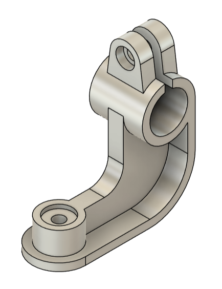
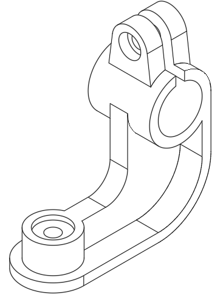
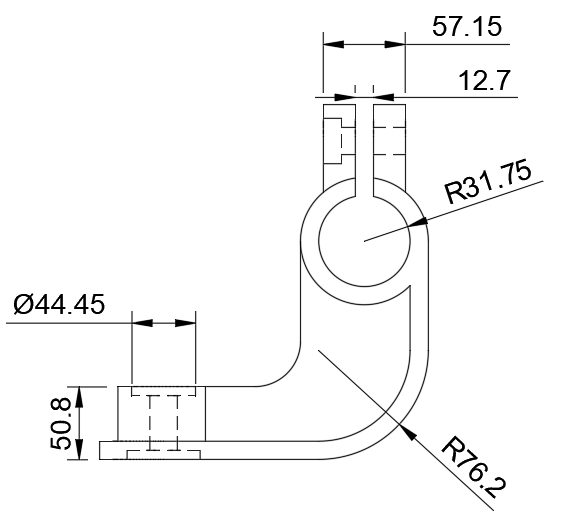
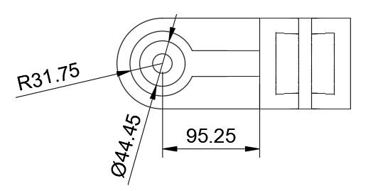

# Mounting-Bracket
CAD files for a 3D-printable articulated mounting bracket

## 

I created this part in Fusion 360, which was the perfect tool for the job. My goal was to design a lightweight yet sturdy bracket that could securely mount an accessory to a bike frame.

## 

I used a few core features in Fusion 360 to bring this design to life: 
  Extrude: I began with a 2D sketch of the part's profile and extruded it to give it its initial thickness. This is always the first step for a part like this.
  Fillets and Chamfers: I added fillets and chamfers to smooth out the edges, which is important for both aesthetics and safety.
  Holes and Circular Patterns: I used the hole command to create the precise mounting holes.
  Used the Rib tool to create the supporting rib.

## 
One of the great things about Fusion 360 is how easy it is to iterate. I could make small changes, like adjusting the diameter of a hole or the radius of a fillet, and see the result instantly. This allowed me to refine the design until I was confident it would perform exactly as intended.
